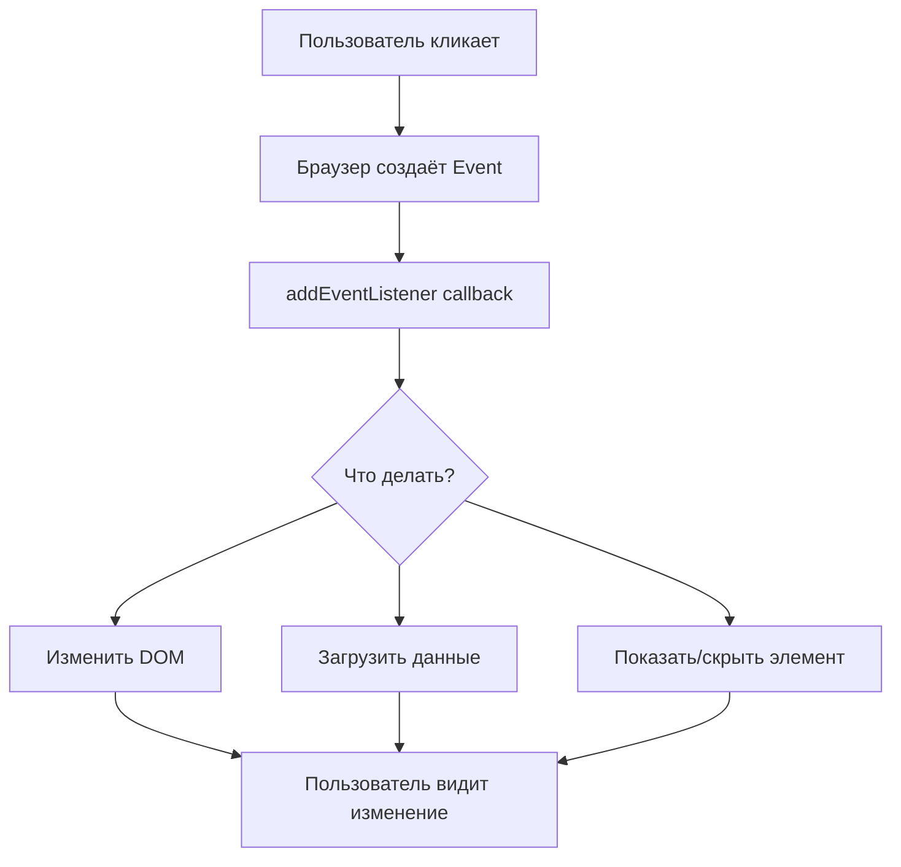

# Диаграммы: DOM и События

## DOM-дерево

```
document
└── html
    ├── head
    │   ├── title
    │   └── link
    └── body
        ├── header
        │   └── nav
        │       ├── a (Профиль)
        │       └── a (Матчи)
        ├── main
        │   ├── h1 ("CS2 Stats")
        │   └── div.cards
        │       ├── div.card
        │       └── div.card
        └── footer
```

## Поток событий



## Fetch + DOM

```
1. Пользователь вводит Steam ID
           ↓
2. JS: fetch('api/players/...')
           ↓
3. API возвращает JSON данные
           ↓
4. JS: createElement, textContent = data
           ↓
5. JS: appendChild → страница обновляется
           ↓
6. Пользователь видит данные игрока
```
